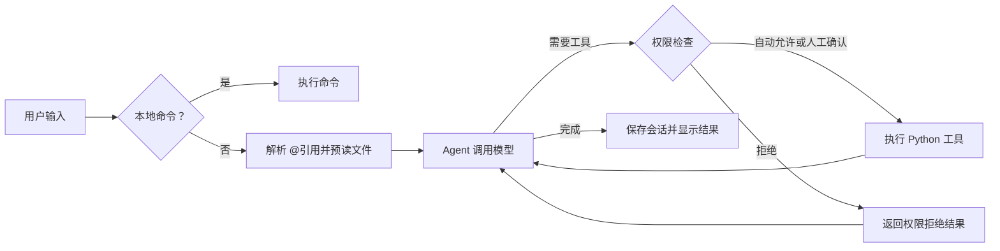

# Coding Agent CLI

一个使用 Python 和 Pydantic AI 构建的终端编程助手。输入自然语言需求后，Agent 调用 DeepSeek 模型，并按需读取文件、写入代码或执行命令，最后展示回复和工具调用过程。

项目代码附有中文注释，适合学习命令行交互、Agent 工具调用和会话管理。

## 功能

- 多轮对话：将历史消息传入下一轮任务。
- 会话持久化：每轮成功后追加保存，重启后用 `/resume` 恢复聊天上下文。
- 文件工具：带行号分页读取 UTF-8 文件、完整写入或唯一文本局部替换。
- 文件保护：先读后改、版本核对、重复读取去重与同一轮编辑排队执行。
- 文件引用：输入 `@` 选择项目文件，提交前预读，第一次模型请求即包含文件内容。
- 上下文注入：自动提供运行环境与 AGENTS.md 项目约定，请求前提醒已读文件的外部变化。
- 命令工具：执行 shell 命令，返回输出和失败信息。
- 逐步展示：模型返回时显示文本与工具调用，每个工具返回时立即显示结果。
- 会话统计：查看累计 token 用量，以及最近一轮模型 API 调用详情。
- 本地配置：从项目根目录的 `.env` 加载 API Key。
- 错误恢复：API 请求自动重试，工具错误反馈给模型，本轮失败后 CLI 仍可继续输入。
- 权限审批：执行前检查工具及完整参数，支持四种模式、临时授权与拒绝说明。
- 自动审批：`auto` 模式由独立模型请求审查操作，无法自动放行时回退人工确认。
- 主动提问：模型可批量澄清需求，终端支持单选、多选、自定义回答和取消。
- 任务管理：四个任务工具维护多步计划，独立保存进度，请求前注入清单并在终端展示。
- 长期记忆：项目级 Markdown 文件保存偏好和约定，索引常驻、正文按需读取，后台提炼并定期合并。
- 回退检查点：`/rewind` 可回退对话、代码或两者，保留原会话并保护外部修改。

## 长期记忆

解决“新会话忘了上次约定”：聊天历史属于会话，记忆属于当前工作目录对应的项目。`/new` 清空聊天和任务，保留 `.memory/`；重启后无需 `/resume`，新会话也能按需读这些记忆。

启动后可以输入：

```text
记住：这个项目的 Git 提交信息必须使用 feat/fix 前缀。
/memory
/new
为新增登录功能写一条提交信息。
```

明确要求记住时，主模型可调用 `memory_write`，默认模式需要确认，输入 `y` 才写入。修改旧记忆先 `memory_read`，携带返回的 `revision`；忘记某条则 `memory_delete`，仍经过审批。`acceptEdits` 自动允许记忆写入，但删除仍需确认；`auto` 使用既有分类器；`bypass` 跳过审批。只读召回直接允许。

一条记忆就是一个 `.memory/<编号>.md` 文件，例如：

```markdown
# 提交信息约定

> 摘要：Git 提交信息使用 feat/fix 前缀

本项目的 Git 提交信息必须带类型前缀。
例如：feat: 新增登录功能；fix: 修复登录失败。
```

模型工具 `memory_write` 接受 `memory={id,title,summary,content}` 和 `expected_revision`。新建版本传空字符串，更新传 `memory_read` 给出的内容哈希。标题/摘要必须单行，编号使用以字母开头的小写字母、数字、下划线或连字符。可用编辑器直接改 Markdown，保留标题、空行、摘要、空行、正文的格式。

每次模型请求，`project_instructions(ctx)` 重新读取记忆文件，生成仅含 `id/title/summary` 的索引，和环境信息一起进入系统 instructions。正文不会全部自动注入；模型发现相关条目才发起 `memory_read`，Python 读 Markdown 返回正文，SDK 将工具结果交给下一次请求。索引由磁盘实时生成，没有另外维护容易失步的索引文件。

成功轮次结束后，主循环把 `result.new_messages()` 交给 `MemoryWorker.schedule()`。后台只挑真正的用户原话，排除模型文本、工具结果、程序提醒，发起独立的 Chat Completions 请求，返回结构化 `memories`。它没有任何工具，无法执行命令；Python 校验结果后，只向当前项目的 `.memory/` 保存稳定约定/偏好。当前版本不从工具输出自动学习“踩坑”，这类确认过的经验可以明确要求模型用 `memory_write` 保存。

后台队列串行处理，每成功处理 5 轮尝试合并一组同主题的重复记忆。先备份原文到 `.memory/.merge-backups/<编号>/`，写入合并内容后再删除重复项；备份不参与索引。模型提炼可能有误，用户可编辑正文，也可从备份取回合并前的文件。

后台请求和主 Agent 使用同一模型配置，独立请求超时 15 秒，不额外重试；会增加 API 消耗，当前不计入 `/status` 和 `/api-detail` 的主 Agent 统计。提炼尚未结束时，`/memory` 展示的是已经落盘的内容。正常退出最多等 20 秒收尾，强制关闭进程可能丢失未完成提炼；失败会提示，已有记忆保留，主任务不重跑。

落盘前检查审阅时的完整快照，用户或工具改过文件就拒绝旧裁决。显式保存/忘记会让旧后台任务失效，避免被旧偏好写回；本轮拒绝记忆工具时，后台也跳过提炼。单次多条提炼不是整体事务：后续写入故障时，之前成功保存的条目仍可能保留。按单 CLI 进程使用，不支持多个进程同时改同一记忆库。

记忆只作为背景，当前需求优先，不能恢复过去的工具授权；auto 分类器也不把记忆正文当成用户授权。保存敏感信息的禁止要求由模型提示约束，并非秘密识别器，使用 `/memory` 和编辑器检查实际保存内容。每项目最多 32 条，每条正文最多 6000 字符；不引入向量库。`.memory/` 已被 Git 和文件补全清单排除。

## 回退对话和代码

输入 `/rewind`，选择一条用户需求，然后选择模式；恢复到的是**这条需求开始之前**，包括撤销该轮及后续轮次。编号列表展示各轮原话和登记文件数量，模式选择前展示涉及的文件路径。回车、`q`、Esc、Ctrl-C/Ctrl-D 可以取消。

| 模式 | 聊天历史 | 文件 |
|---|---|---|
| 1：仅对话 | 截断到检查点，保存到新会话分支 | 保留当前代码；追加程序提醒，避免使用旧工具结果 |
| 2：仅代码 | 保留当前对话，追加重新读取文件的提醒 | 恢复修改前字节，删除选中轮次之后由文件工具新建的文件 |
| 3：对话和代码 | 截断并另开分支 | 同时恢复文件 |

例：初始 `app.py` 端口 8000，第一轮改成 8080，第二轮改成 9000 并新建 `config.py`。选第二轮、模式 3 后，端口回到 8080，`config.py` 被删除，聊天只保留第一轮；第二轮原话回到输入区，可以编辑后重新提交。原会话可用 `/resume` 找回，但恢复聊天不会重新应用它当时的代码。

实现使用文件备份，不创建 Git commit 或改变分支。每轮在模型和预读运行前建立检查点，记录用户输入、`history_count` 和任务快照。`write_file`/`edit_file` 完成权限/已读/版本校验后，先保存修改前与预计修改后的文件字节、登记版本，再真正修改文件；备份失败则不修改代码。同一文件多次修改均登记，恢复时使用所选检查点后第一次修改之前的版本。

文件存储：

```text
.sessions/
├── <session_id>.jsonl        # 完整聊天轮次
├── <session_id>.tasks.json   # 当前任务状态
├── <session_id>.rewind.json  # 各轮检查点、文件路径及版本编号
└── versions/
    ├── <SHA256版本编号>      # 修改前/后的完整原始字节
    └── ...
```

`versions` 用真实内容哈希命名，相同内容复用备份。空文件有自己的哈希；`before=null` 表示原来不存在，恢复时删除新文件，不能与空文件混为一谈。二进制字节备份保留 UTF-8 BOM、CRLF 等，不按显示过的行号重新构造正文。

恢复前先检查所有涉及的文件：磁盘内容必须匹配最后一次登记操作的修改前或修改后版本，备份哈希必须正确，路径必须仍在当前项目且不含符号链接跳转。发现编辑器/命令造成的不同内容，整次停止，不强行覆盖。恢复执行期间再次核对版本。普通 I/O 故障会尝试撤销已恢复的文件；若补偿也失败，提示部分恢复并保留日志/备份，不能误报成功。多个文件的恢复不是文件系统级事务，强制终止进程可能留下部分恢复。

对话回退先保存原会话，再创建新的 UUID 分支，保存保留的完整 SDK 消息及检查点任务快照；任务状态随对话一起回退，文件模式不改任务。历史按轮次起点截断，保留消息配对，不重放旧工具。临时文件已读状态和记住的工具许可清空；权限模式保留。已实际消耗的 token 计数保留，不因撤销消息而归零。

检查点和版本都被 `.sessions/` 的 Git 忽略规则覆盖，可重启后 `/resume` 再 `/rewind`。失败轮次也保留检查点，第一轮失败且还没有聊天 JSONL 时仍能找到该会话。功能启用前的旧消息没有备份，不能补造回退点。

范围仅包括当前项目内通过 `write_file`/`edit_file` 修改的普通文件。`run_command`、编辑器、数据库、网络请求的副作用不自动撤销；项目外文件、`.git`、`.sessions`、`.memory`、虚拟环境、依赖及程序内部目录不参加回退。目录创建本身不回退。已落盘的长期记忆保留，撤销时使尚未完成的后台提炼失效。按单 CLI 进程使用，备份目前不自动清理；检查点记录绝对项目路径，移动项目后不直接恢复旧路径。

## 快速开始

以下命令适用于 Windows PowerShell，请先安装 Python 和 Git。

### 1. 获取项目

```powershell
git clone https://github.com/ranjianghong526-hash/coding-agent-cli.git
cd coding-agent-cli
```

已有本地项目时，直接进入项目根目录。

### 2. 创建环境并安装依赖

```powershell
python -m venv .venv
.\.venv\Scripts\python.exe -m pip install -r requirements.txt
```

这里直接使用虚拟环境中的 Python，无需先激活环境。

### 3. 配置 API Key

如果还没有 `.env`，复制模板：

```powershell
Copy-Item .env.example .env
```

已有 `.env` 时直接编辑，避免覆盖现有配置。填入自己的 DeepSeek API Key：

```dotenv
API_KEY=你的DeepSeek密钥
```

程序也支持系统环境变量 `API_KEY`；已设置的环境变量优先于 `.env`。`.env` 被 Git 忽略，`.env.example` 仅提供空配置模板。

模型名在 `agent/core.py` 的 `MODEL_NAME` 中配置，当前值为 `deepseek-flash`。如接口返回模型不可用，请将其改为你的服务支持的模型名称。

### 4. 启动

```powershell
.\.venv\Scripts\python.exe main.py
```

建议始终从项目根目录启动，因为工具中的相对路径按进程工作目录解析。

## 使用示例

在程序的 `❯` 提示符后输入：

```text
请读取 main.py，解释主循环的执行流程，不修改文件。
```

也可以要求 Agent 修改代码并运行验证。具体是否调用工具以及调用顺序，由模型根据需求判断。

### 用 @ 引用文件

```text
解释 @main.py 的主循环
比较 @agent/core.py 和 @agent/hooks.py
修改 @"docs/中文 笔记.md" 的标题
```

输入 `@` 后展示候选，继续输入文件名或路径片段筛选；用上下方向键选择、Tab 补全、Enter 提交。含空格的路径自动加双引号，也可以手动输入。补全保留前面的需求文字，Shift+Tab 仍切换权限模式。引用须出现在输入开头或空白后，邮箱中的 `@` 不会识别为引用。

候选来自当前工作目录。Git 项目使用 `git ls-files --cached --others --exclude-standard`，包含已跟踪和未忽略的新文件；另排除密钥、会话、依赖和缓存目录。没有 Git 时退回目录遍历，排除已知依赖目录，此时不解析 `.gitignore`。手动输入的引用不依赖候选清单，仍按真实路径读取。

提交时执行以下步骤：

1. `extract_mentions()` 从用户原话提取路径，同一规范化路径本轮只读一次。
2. `prepare_file_messages()` 调用共享的 `read_file_content()`，默认展示前 200 行，并登记当前版本和已读区间。重复引用使用 `force=True` 重新展示当前正文；长文件提示模型继续分页，读取失败则提供错误结果。
3. 程序生成三组消息：`user-prompt` 保存原话、`tool-call` 描述已执行的读取、`tool-return` 保存真实文件内容。调用和返回的 ID 一一对应；这些读取由程序预先执行，不需要模型请求，也不会再次执行。
4. `run_agent()` 把三组消息接在旧历史后，使用 `agent.iter(None, message_history=history, ...)`。传 `None` 是因为用户原话已经在历史中，避免重复追加。第一次模型请求即可看到文件内容，后续需要编辑时仍经过现有权限与版本检查。
5. 成功后照常保存完整历史，`/resume` 可恢复这些消息。失败轮次不提交历史，同时清空文件读取登记，避免把未进入历史的内容记为模型已读。

文件正文属于工具结果，不能拼接成用户授权。auto 分类器沿用原有过滤规则，会丢弃文件正文，只保留你的原话和工具调用。预读不额外消耗一次模型请求，但发送的文件内容仍计入主模型的输入用量。`@` 引用本身只读文件，不自动允许后续写入。

### 自动注入项目上下文

系统上下文分三类：

| 类型 | 内容 | 注入位置 |
|---|---|---|
| 固定 instructions | 编程助手身份、先读后改、尊重权限拒绝 | `agent/core.py` 的 `Agent(instructions=...)` |
| 动态 instructions | 当前时间与时区、工作目录、操作系统、项目文件路径、Git 状态、AGENTS.md | `@agent.instructions` 回调，每次模型请求重新生成 |
| 实时提醒 | 已读文件被外部修改、删除或无法核对 | `before_model_request` 中追加普通请求消息 |

从项目根目录启动，在该目录放置 UTF-8 的 `AGENTS.md`，例如：

```markdown
# 项目约定
- Python 变量名使用 snake_case。
- 注释使用中文。
- 优先修改现有实现，不新增无必要依赖。
```

随后正常提出需求，程序会自动加载约定，不需要每次重复粘贴或要求模型自行读取。当前仅加载工作目录根部的 `AGENTS.md`，不递归加载子目录或父目录规则。目录信息只提供文件路径，默认最多 100 个；AGENTS.md 最多 10,000 字符，Git 状态最多 6,000 字符，超限标明截断。普通项目文件的正文不会因为环境采集而自动发送；按需使用 `@` 或 `read_file`。

动态回调使用后台线程，每次模型请求都会重新读取环境，包括同一轮工具执行后的后续请求，因此约定、日期和 Git 状态不使用 LRU 缓存。Git 不可用、非仓库或 AGENTS.md 编码错误会作为明确的环境状态交给模型，不因此终止任务。

文件变化示例：

```text
模型读取 config.py，看到 timeout = 10
你在编辑器中改成 timeout = 20
下一次模型请求前，程序检测到版本变化
  → 注入提醒：“旧工具结果可能过期，请重新 read_file”
  → 模型可选择重新读取，再依据当前正文处理
```

检测复用已有修改时间、大小、文件身份和 SHA-256 版本比较，保留修改时间的内容变化也能发现。每个变化后的版本只提醒一次；模型自己通过文件工具成功编辑会刷新已读版本，不被误判为外部修改。提醒不直接发送新正文、不把新版本登记为已读，也不会替用户撤销磁盘修改。模型忽略提醒时，现有文件工具仍会拒绝用过期版本写入。

提醒使用 `ModelRequest(UserPromptPart(...))`，正文带 `<system-reminder>` 标签，消息元数据另标明 `context_injection="system-reminder"`。它走普通对话通道，默认不在 CLI 显示；成功轮次与完整历史一起保存，恢复后仍能识别来源。SDK 发送前可能合并相邻请求；元数据只供程序识别，不会发送给模型。auto 分类器从原始历史中排除这类消息，不把它们算作用户授权；用户亲自输入相同标签仍保留为真实用户输入。

环境信息和提醒不额外调用一次模型，但会增加主模型的输入用量。每次请求检查已读文件时会重新读取字节核对摘要，大量或很大的已读文件会增加本地 I/O；单次最多提醒 50 个文件，未处理的变化留到后续请求。它提供提醒和版本保护，不是实时文件监控，也不能消除检查后文件再次变化的竞争窗口。

### 主动向用户提问

例如输入：“帮我写一个前端页面，先问我使用哪个框架、需要哪些功能，再动手。”模型可以调用 `ask_user_question`，一次提出 1～4 个相关问题。是否提问由模型判断；重要歧义应澄清，常规实现细节直接完成。

每题可提供 2～4 个带描述的选项，也可以不提供选项、直接接收文本；始终允许“其他（输入自定义文本）”。用 ↑↓ 移动选项、回车选择，单选自动进入下一题；多选用空格勾选、回车确认。←→ 切换题目，最后到“提交”页检查所有答案并按回车提交。自定义输入时左右键用于编辑文字。Esc、Ctrl-C、Ctrl-D 取消整批提问，不提交部分草稿。

链路是：模型提出工具调用 → SDK 校验问题参数 → 权限 hook 直接允许提问 → 终端表单等待 → `ToolReturn` 返回答案 → SDK 将结果交给下一次模型请求。提问本身不会写文件、执行命令或再调用分类器。模型只能提供问题和选项，不能在参数里填写用户答案。

工具结果示例：

```json
{"status":"answered","answers":[{"question":"使用哪个框架？","selected_options":["Vue"],"custom_answer":""}]}
```

取消返回 `{"status":"cancelled","answers":[]}`。回答以工具结果进入主模型历史，成功轮次照常保存和恢复。程序另附不发送给模型的 `metadata` 来源标记；auto 审批只从带此标记的真实提问结果提取已确认答案，普通文件内容和工具输出仍丢弃。问题文字由模型生成，不单独构成用户授权；用户回答也不会绕过后续权限检查。

### 跟踪多步任务

复杂需求可以输入：“重构这个模块，先拆成任务清单，再逐项实现并验证。”模型根据需要创建任务，简单请求无需建清单。四个工具都操作当前会话的独立任务状态：

| 工具 | 参数 | 作用 |
|---|---|---|
| `task_create` | `subject`、可选 `description` | 创建一项 `pending` 任务，返回新编号 |
| `task_get` | `task_id` | 查看标题、完整要求和状态 |
| `task_update` | `task_id`、可选 `status` / `subject` / `description` | 至少更新一个字段；状态可设为 `pending`、`in_progress`、`completed` 或 `deleted` |
| `task_list` | 无 | 查看当前会话所有任务 |

例如：

```text
task_create(subject="理解现有模块", description="检查入口和调用方") → id=1，pending
task_create(subject="实现修改并测试") → id=2，pending
task_update(task_id=1, status="in_progress") → 开始阅读
read_file(...) → 真正读取代码
task_update(task_id=1, status="completed") → 标记阅读完成
task_get(task_id=2) → 查看下一项要求
```

`task_update` 只修改计划，不自动读写项目文件、不启动命令。`completed` 是模型维护的声明，Python 不会凭它验证代码已经正确；提示词要求模型实际完成并验证后再标记。允许重新设为 pending 或 in_progress，以便返工。`deleted` 只移除任务项，不删除项目文件，且旧编号不会复用。每个会话最多保留 100 项，标题最多 200 字符、描述最多 3,000 字符。

任务保存为 `.sessions/<session_id>.tasks.json`，聊天仍保存为同编号的 `.jsonl`。每次创建或更新，先写同目录临时文件、同步数据、原子替换，再更新内存；保存失败不返回成功状态。任务文件被现有 `.sessions/` 忽略规则覆盖，不进入 Git。

每次模型请求前，`before_model_request` 从任务存储生成最新标题和状态清单，以带来源标记的 `<system-reminder>` 追加；完整描述通过 `task_get` 按需读取。清单与聊天历史独立，因此历史丢失或未来压缩后仍能提供当前进度；当前项目尚未实现上下文压缩。任务提醒不作为 auto 审批的用户授权，后续文件和命令工具仍经过权限检查。

任务创建或更新后立即打印清单，主输入前也显示；`/tasks` 可本地查看，无需请求模型。`/new` 切换到空清单，旧文件保留；`/resume` 恢复所选会话的任务，不重跑旧工具。若第一轮中途失败，只有任务文件、还没有完整聊天轮次，也可从 `/resume` 找回计划，此时聊天历史为空。

任务管理工具在所有权限模式下直接允许，它们只维护受限的会话计划文件。模型负责决定是否建计划、何时更新；清单不会强制执行某种顺序，也不会让未完成任务自动运行。任务写入是即时的，一轮失败时已保存的任务进度保留；多进程同时编辑同一会话不提供冲突合并。

### 本地命令

| 命令 | 作用 |
|---|---|
| `/help` | 显示可用命令 |
| `/new` | 保存当前历史，开启独立的新会话；保留旧会话文件 |
| `/resume` | 列出当前项目的已保存会话，输入编号恢复 |
| `/status` | 显示会话编号、模型、权限模式、历史消息数量和累计 token 用量 |
| `/tasks` | 查看当前会话任务清单，不调用模型 |
| `/memory` | 查看项目长期记忆索引及保存目录，不调用模型 |
| `/rewind` | 选择检查点，回退对话、代码或两者，不调用模型 |
| `/api-detail` | 显示最近一轮每次模型调用的请求与响应摘要 |
| `/exit` | 退出程序 |

这些命令在本地处理，不触发模型请求。输入阶段也可以使用 Ctrl-C 或 Ctrl-D 退出。

### 工具权限审批

启动时使用 `default` 模式。在主输入区按 **Shift+Tab**，按 `default → acceptEdits → auto → bypass → default` 顺序切换，底部提示栏显示当前模式，`/status` 也可查看。按两次即可从默认模式进入 `auto`。

| 模式 | `read_file` | `write_file` / `edit_file` | `run_command` |
|---|---|---|---|
| `default` | 自动允许 | 执行前确认 | 执行前确认 |
| `acceptEdits` | 自动允许 | 自动允许 | 执行前确认 |
| `auto` | 自动允许 | 分类器审查，不放行则人工确认 | 分类器审查，不放行则人工确认 |
| `bypass` | 自动允许 | 自动允许 | 自动允许 |

`ask_user_question` 和四个任务工具在所有模式下直接允许：提问只收集回答，任务工具只维护独立计划。其他新工具默认需要审批，在 `auto` 下先交给分类器；只有明确白名单与模式规则直接放行。审批界面完整显示工具参数，例如：

```text
工具执行需要确认：write_file
{
  "path": "1.txt",
  "content": "你好"
}
审批 [默认拒绝] ❯
```

- 输入 `y` 或 `1`：仅允许这一次。
- 输入 `a` 或 `2`：本次程序运行中，相同工具名及完整参数不再询问。任意参数变化都需要重新确认，例如写入内容变化或命令附加新操作。
- 输入 `n` 或 `3`：拒绝；可附说明，如 `n 请先读取文件，不要覆盖`。
- 回车、Ctrl-C、Ctrl-D：拒绝当前工具调用，Agent 收到拒绝结果后继续处理。

拒绝由执行前 hook 使用 `SkipToolExecution` 拦截，真实工具不会执行，模型收到 `[权限拒绝]` 工具结果；这不会消耗 `ModelRetry` 的修正次数。多个并发调用的审批输入通过锁串行处理。审批区域不绑定模式切换快捷键。

权限模式与临时授权属于本次程序运行：`/new`、`/resume` 保留当前权限设置，不把它们写入聊天记录；重启后重新回到 `default`。权限检查只拦截本 Agent 经 SDK 发起的工具调用，工具函数被其他 Python 代码直接调用时不经过此 hook。它不是操作系统沙箱，也不限制已经允许的 shell 命令内部会执行哪些操作。

### auto 自动审批

`auto` 继续使用同一个执行前 hook，只读操作和已有人工临时授权仍直接通过。其余工具调用先发送独立的分类器请求：

```text
✻ auto 正在审查 run_command…
auto 审查：运行测试符合用户明确提出的要求
```

返回严格的 `{"should_block": false, "reason": "..."}` 时自动允许；返回 `true` 或审查失败时打印理由，再使用原有 `y / a / n` 人工审批。`should_block` 表示停止自动执行，不是直接替用户做最终拒绝。自动允许不记入临时授权，每次重新审查当前上下文；选择 `a` 的人工授权仍仅匹配相同工具和完整参数。

分类器使用 `core.py` 当前模型与 API 配置，单独调用 Chat Completions，不经过主 Agent 的 hooks。超时 15 秒、不额外重试；网络故障、响应未正常完成、无效 JSON、非布尔裁决或空理由都回退人工，用户主动中断仍向外传播。

审查材料保留用户输入、工具调用以及程序标记过的真实提问答案；普通工具结果、模型正文和思考片段不发送。提问答案用 `user_answer` 单独表示，问题本身不构成授权。每行使用 JSON 编码，避免参数中的换行伪造独立的用户授权行；最后一行为本次待审查操作。完整参数不截断，转写超过 60,000 字符时直接回退人工，并附上项目目录、工作目录与临时目录供判断路径范围。

这是额外的模型请求，会增加等待和服务端用量；当前 `/status` 的 token 统计与 `/api-detail` 只覆盖主 Agent，不包含分类器请求。筛选转写、严格校验和失败回退能减少误放行风险，模型审查仍可能判断错误，不提供操作系统隔离。

### 可靠文件编辑

文件工具通过 SDK 注入的 `RunContext` 获取会话级 `FileContext`，模型只提供下面这些参数，不提供 `ctx`：

| 工具 | 参数及行为 |
|---|---|
| `read_file` | `path`，可选 `offset=1`、`limit=200`、`force=False`；展示带行号的指定行区间 |
| `write_file` | `path`、`content`；创建新文件或整体重写，父目录必须存在 |
| `edit_file` | `path`、`old_string`、`new_string`；精确替换唯一一处原文，可用空的新文本删除片段 |

修改已有文件必须先成功读取。整体覆盖还要求本会话已读取全部行；局部编辑只要求匹配位置已经读过。多个分页读取会合并已读范围。重复读取相同版本和范围只返回“文件未变化”，需要再看正文时设置 `force=True`；行号是展示信息，不属于要复制匹配的原文。

```text
read_file(path="config.py")
  → 展示：1 | timeout = 10
edit_file(path="config.py", old_string="timeout = 10", new_string="timeout = 30")
  → 只修改这一处，其他内容保持
```

每次读取记录规范化路径、纳秒修改时间、文件大小、文件身份、SHA-256 摘要和已读行区间。写入时重新读取磁盘，核对版本：用户在编辑器修改、替换或删除文件后，旧快照不能继续覆盖。即使保留原 mtime，内容摘要也能发现变化。找不到原文或原文匹配多处（包括重叠匹配），均返回错误且不写入，不进行模糊替换。

已有文件先写同目录临时文件、同步数据、再次核对版本，再原子替换；失败时清理临时文件。局部编辑保留未修改字节，以及纯 CRLF 文件的换行和 UTF-8 BOM。新建文件采用硬链接排他发布，用户恰好创建同名文件时不会覆盖；不支持硬链接的文件系统会明确返回错误，不降级为覆盖写入。

全部工具都注册为 `Tool(..., sequential=True)`，SDK 按模型给出的顺序执行，文件工具另用会话内线程锁保护读取、检查和写入。成功写入后刷新状态，后续编辑依据新版本；局部读取后的编辑不会被登记成完整读取。`/new`、`/resume` 会清空文件快照，恢复聊天历史后仍须重新读磁盘。

权限审批与文件保护是两道检查：先按模式确认“能否执行”，再由工具检查“是否读过、版本是否一致、匹配是否唯一”。即使 `bypass` 或 `acceptEdits` 放行，文件保护也不会跳过。`edit_file` 在 `default` 中需确认、在 `acceptEdits` 中自动允许、在 `auto` 中进入分类器。

版本核对不是跨进程事务：外部程序仍可能在最后一次检查与替换之间修改文件；`run_command` 中的任意 shell 写入也不受文件工具内部保护。当前按单个 CLI 会话使用，不承诺多个进程协调编辑。

### 保存与恢复聊天

每个会话对应项目根目录 `.sessions/<会话编号>.jsonl`。每轮成功完成后追加一行，包含本轮新增的完整消息、保存时间、模型名和累计 token 用量。消息包含用户输入、模型响应、工具调用及工具结果；不是只有终端展示的文字摘要。`.sessions/` 已加入 Git 忽略。

```text
第一次启动：输入需求 → 完成后自动保存 → /exit
再次启动：/resume → 输入列表中的编号 → 输入“继续刚才的工作”
```

程序每次启动默认创建新会话，需要恢复时手动输入 `/resume`。列表按最近更新排序，显示第一条用户消息作为标题；回车、`q` 或输入阶段的 Ctrl-C/Ctrl-D 可以取消选择。恢复后继续追加同一文件，累计统计也随会话恢复，模型仍使用当前 `agent/core.py` 的配置。

`/new` 切换到新编号，并清空内存历史与统计，不删除旧记录。历史恢复不会重跑旧工具，也不会把文件恢复到过去的版本。最近一轮 `/api-detail` 调用摘要不持久化，恢复时清空。

保存失败时会提示，并保留内存历史供下轮补存；退出前未成功保存的内容仍可能丢失。崩溃留下的未完成末行会被忽略，下次写入时修复；完整行损坏的文件会在 `/resume` 中报告并跳过，原文件不会删除。

## 项目结构

```text
coding-agent-cli/
├── main.py               # 入口、输入循环、命令分流和结果处理
├── session_store.py      # JSONL 追加保存、扫描与完整消息恢复
├── task_store.py         # 独立任务状态、原子保存、会话切换与任务提醒
├── memory_store.py       # Markdown 记忆、索引、版本保护与合并备份
├── memory_worker.py      # 独立后台提炼请求、串行队列与定期合并
├── rewind_store.py       # 每轮检查点、文件版本备份、冲突检查与代码恢复
├── rewind.py             # 对话分支、三种回退模式与运行状态同步
├── permissions.py        # 四种权限模式、审批输入和本次运行的临时授权
├── classifier.py         # 对话转写、独立模型审查与严格裁决校验
├── file_state.py         # 文件版本、已读行区间与会话内线程锁
├── file_mentions.py      # @补全、引用解析和预读工具消息
├── context_injection.py  # 动态环境、项目约定、外部变化提醒与来源标记
├── agent/
│   ├── __init__.py       # Agent 包的公开接口
│   ├── core.py           # 加载配置，组装模型、工具和 hooks
│   ├── tools.py          # 文件、命令、主动提问和四个任务工具
│   └── hooks.py          # 模型调用日志、执行前审批与未知工具异常修正
├── ui/
│   ├── __init__.py       # UI 包标识
│   ├── commands.py       # 会话状态、斜杠命令和消息展示
│   ├── questions.py      # 问题协议、选项表单、真人回答与提交/取消
│   └── render.py         # 共享终端输出、缩进和欢迎横幅
├── .env.example          # 空密钥配置模板
├── .gitignore            # 排除本地密钥、会话记录、虚拟环境和缓存
├── test_session_store.py # 保存、恢复、写入异常与继续对话的离线测试
├── test_permissions.py   # 审批拦截、授权范围、并发输入与快捷键离线测试
├── test_auto_mode.py     # 自动允许、人工回退、审查协议与转写离线测试
├── test_file_edit.py     # 先读后改、版本冲突、唯一匹配和排队编辑测试
├── test_file_mentions.py # @补全、首次请求带内容、编辑与持久化测试
├── test_context_injection.py # 动态约定、外部修改、提醒来源与恢复测试
├── test_memory.py        # 重启召回、真实 SDK、后台提炼、冲突与合并测试
├── test_rewind.py        # 检查点、三种模式、失败轮次及恢复冲突测试
├── test_user_questions.py # 提问表单按键、SDK 等待回答、来源过滤与恢复测试
├── test_task_management.py # 任务持久化、失败恢复、会话隔离与请求提醒测试
├── requirements.txt      # Python 依赖
└── 项目阅读路线.md         # 分阶段阅读顺序与调用链路
```

## 执行流程



`main.py` 的循环负责多轮用户输入；`run_agent()` 使用 `agent.iter()` 遍历执行节点，在模型返回后展示响应，再消费工具节点事件并立即展示每个工具结果。hooks 仍在每次模型请求前后记录数据，供 `/api-detail` 查看。

## 阅读路线

推荐顺序：`main.py` → 会话状态与命令注册 → `agent/core.py` → `agent/tools.py` → 结果处理 → `agent/hooks.py` → UI 展示。

学习持久化时，沿着 `apply_result()` → `save_session()` → `cmd_resume()` → `load_session()` → `run_agent(message_history=...)` 阅读。

学习权限审批时，沿着 `SessionState.permissions` → `run_agent(deps=...)` → `_approve_tool()` → `check_permission()` → `ask_permission()` 阅读。

学习自动审批时，沿着 `_approve_tool(ctx.messages)` → `check_permission(mode="auto")` → `classify()` → `build_transcript()` → `Verdict` → 自动返回或 `ask_permission()` 阅读。

学习文件编辑时，沿着 `FileContext` → `read_file()` 登记 → `edit_file()` / `write_file()` 内部校验 → `_atomic_write()` → 更新读取状态阅读。

学习文件引用时，沿着 `FileMentionCompleter` → `extract_mentions()` → `prepare_file_messages()` → `read_file_content()` → `run_agent()` 中的历史拼接与 `prompt=None` 阅读。

学习上下文注入时，沿着 `Agent(instructions=...)` → `project_instructions()` → `build_project_context()` → `before_model_request` → `collect_external_changes()` → `make_system_reminder()` → 分类器来源过滤阅读。

详细步骤、学习目标和动手练习见 [项目阅读路线](项目阅读路线.md)。

## 错误处理与重试

错误在三个位置处理，网络重试与模型修正是两个不同机制：

| 位置 | 处理方式 | 示例 |
|---|---|---|
| API 客户端 | 单次请求超时 30 秒；暂时性的网络、超时、限流及服务端故障最多额外重试 2 次 | 429、503 后恢复时，继续当前请求，不重新执行已完成的工具 |
| 工具函数 | 已知文件、权限、编码、命令启动或超时错误返回明确的错误文本 | 读取不存在的文件，把原因交给模型，让它调整操作 |
| 工具异常钩子 | 未知异常转换成 `ModelRetry`，由模型修正；每个工具最多额外修正 2 次 | 工具抛出 `ValueError` 后，模型收到 `retry-prompt` |
| 主循环 | 捕获最终失败，显示中文提示，然后继续等待输入 | API Key 无效时提示检查配置，而不因本轮请求失败退出 |

401 等普通鉴权错误不会自动重试。API 失败也会在 `/api-detail` 中记录结束原因。失败轮次不加入对话历史，但保留最近调用摘要并累计已经得到的用量；没有响应的请求无法在本地确认 token 用量。

程序不会自动重跑整轮任务，也不会撤销已发生的文件或命令操作。用户主动中断时退出，不把中断当成可重试的工具错误。启动前仍需安装依赖并配置非空 `API_KEY`。

### 离线验证

```powershell
.\.venv\Scripts\python.exe -X utf8 -m unittest -v test_realtime_output test_error_handling test_session_store test_permissions test_auto_mode test_file_edit test_file_mentions test_context_injection test_user_questions test_task_management test_memory test_rewind
```

测试使用模拟模型和 HTTP 传输，不访问真实 DeepSeek，不使用真实 API Key。覆盖逐步展示、限流恢复、鉴权失败、工具故障及重试耗尽、会话保留和中断等场景。

持久化测试使用临时目录，覆盖完整消息往返、只追加新增消息、取消恢复、切换前保存失败、坏文件与不完整末行，以及恢复后旧历史进入下一次模型请求。

权限测试覆盖四种模式、拒绝时不发生写入或启动进程、授权只匹配相同参数、并发审批不重叠、缺少权限上下文时拒绝执行，以及模拟终端中的真实 Shift+Tab 按键。

auto 测试模拟独立 API，覆盖转写过滤与 JSON 转义、完整命令保留、严格布尔裁决、截断响应及超时、材料过大回退、本轮用户输入进入审查、自动允许后实际写入，以及人工拒绝时不写入。

文件编辑测试使用临时文件，覆盖分页去重、部分与完整读取、文件变动及删除、保持 mtime 的内容变动、唯一匹配、CRLF/BOM 保留、原子替换失败、新建时同名竞争、会话切换清空快照、多个编辑排队和 auto 审批。

文件引用测试覆盖 Git 忽略、中文空格路径、真实 Tab 与 Shift+Tab 按键、多个引用去重、首次模型请求直接含正文、直接局部编辑、分页限制、读取失败、重复引用刷新、JSONL 消息往返，以及文件内容不冒充 auto 审批的用户授权。

上下文测试覆盖时间与目录、AGENTS.md 自动加载和刷新、长度限制与环境失败、每次模型请求重新生成 instructions、外部修改/删除/无法核对、同 mtime 的内容变化、自己的编辑不误报、提醒去重、保留旧版本保护、SDK 合并请求、提醒不显示、auto 来源过滤和 JSONL 元数据恢复。

## 当前实现的边界

- 成功轮次自动保存到本地，重启后通过 `/resume` 恢复；失败或中断轮次不保存到对话历史。
- 存储与 CLI 按串行使用设计，不支持多个进程同时写同一个会话文件。
- 当前按模型响应和工具完成的时机逐步输出，没有逐 token 的文字流式输出。
- 文件工具当前支持 UTF-8，父目录须存在；整体覆盖已有文件必须完整读取且版本一致。
- shell 命令等待超时为 10 秒，工具操作会对本地文件和进程产生实际影响。
- 调用日志按串行执行设计，不能直接用于同时执行多个任务。
- 依赖尚未固定版本；真实 DeepSeek 调用需要配置有效密钥，并确认账号支持当前模型名。
