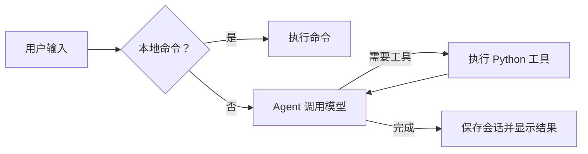

# Coding Agent CLI

一个使用 Python 和 Pydantic AI 构建的终端编程助手。输入自然语言需求后，Agent 调用 DeepSeek 模型，并按需读取文件、写入代码或执行命令，最后展示回复和工具调用过程。

项目代码附有中文注释，适合学习命令行交互、Agent 工具调用和会话管理。

## 功能

- 多轮对话：将历史消息传入下一轮任务。
- 文件工具：读取 UTF-8 文件、写入完整文件内容。
- 命令工具：执行 shell 命令，返回输出和失败信息。
- 逐步展示：模型返回时显示文本与工具调用，每个工具返回时立即显示结果。
- 会话统计：查看累计 token 用量，以及最近一轮模型 API 调用详情。
- 本地配置：从项目根目录的 `.env` 加载 API Key。

## 快速开始

以下命令适用于 Windows PowerShell，请先安装 Python 和 Git。

### 1. 获取项目

```powershell
git clone https://github.com/ranjianghong526-hash/coding-agent-cli.git
cd coding-agent-cli
```

仓库为私有仓库，克隆时需要具有访问权限的 GitHub 账号。已有本地项目时，直接进入项目根目录。

### 2. 创建环境并安装依赖

```powershell
python -m venv .venv
.\.venv\Scripts\python.exe -m pip install -r requirements.txt
```

这里直接使用虚拟环境中的 Python，无需先激活环境。

### 3. 配置 API Key

如果还没有 `.env`，复制模板：

```powershell
Copy-Item .env.example .env
```

已有 `.env` 时直接编辑，避免覆盖现有配置。填入自己的 DeepSeek API Key：

```dotenv
API_KEY=你的DeepSeek密钥
```

程序也支持系统环境变量 `API_KEY`；已设置的环境变量优先于 `.env`。`.env` 被 Git 忽略，`.env.example` 仅提供空配置模板。

模型名在 `agent/core.py` 的 `MODEL_NAME` 中配置，当前值为 `deepseek-flash`。如接口返回模型不可用，请将其改为你的服务支持的模型名称。

### 4. 启动

```powershell
.\.venv\Scripts\python.exe main.py
```

建议始终从项目根目录启动，因为工具中的相对路径按进程工作目录解析。

## 使用示例

在程序的 `❯` 提示符后输入：

```text
请读取 main.py，解释主循环的执行流程，不修改文件。
```

也可以要求 Agent 修改代码并运行验证。具体是否调用工具以及调用顺序，由模型根据需求判断。

### 本地命令

| 命令 | 作用 |
|---|---|
| `/help` | 显示可用命令 |
| `/new` | 清空会话历史、累计用量和最近调用记录 |
| `/status` | 显示模型、历史消息数量和累计 token 用量 |
| `/api-detail` | 显示最近一轮每次模型调用的请求与响应摘要 |
| `/exit` | 退出程序 |

这些命令在本地处理，不触发模型请求。输入阶段也可以使用 Ctrl-C 或 Ctrl-D 退出。

## 项目结构

```text
coding-agent-cli/
├── main.py               # 入口、输入循环、命令分流和结果处理
├── agent/
│   ├── __init__.py       # Agent 包的公开接口
│   ├── core.py           # 加载配置，组装模型、工具和 hooks
│   ├── tools.py          # 读文件、写文件、执行命令
│   └── hooks.py          # 记录每次模型 API 调用的摘要
├── ui/
│   ├── __init__.py       # UI 包标识
│   ├── commands.py       # 会话状态、斜杠命令和消息展示
│   └── render.py         # 共享终端输出、缩进和欢迎横幅
├── .env.example          # 空密钥配置模板
├── .gitignore            # 排除本地密钥、虚拟环境和缓存
├── requirements.txt      # Python 依赖
└── 项目阅读路线.md         # 分阶段阅读顺序与调用链路
```

## 执行流程



`main.py` 的循环负责多轮用户输入；`run_agent()` 使用 `agent.iter()` 遍历执行节点，在模型返回后展示响应，再消费工具节点事件并立即展示每个工具结果。hooks 仍在每次模型请求前后记录数据，供 `/api-detail` 查看。

## 阅读路线

推荐顺序：`main.py` → 会话状态与命令注册 → `agent/core.py` → `agent/tools.py` → 结果处理 → `agent/hooks.py` → UI 展示。

详细步骤、学习目标和动手练习见 [项目阅读路线](项目阅读路线.md)。

## 当前实现的边界

- 会话历史只保存在内存中，退出后不会自动恢复。
- 当前按模型响应和工具完成的时机逐步输出，没有逐 token 的文字流式输出。
- `write_file()` 会覆盖指定文件，不自动创建父目录。
- shell 命令等待超时为 10 秒，工具操作会对本地文件和进程产生实际影响。
- 调用日志按串行执行设计，不能直接用于同时执行多个任务。
- 依赖尚未固定版本；真实 DeepSeek 调用需要配置有效密钥，并确认账号支持当前模型名。
