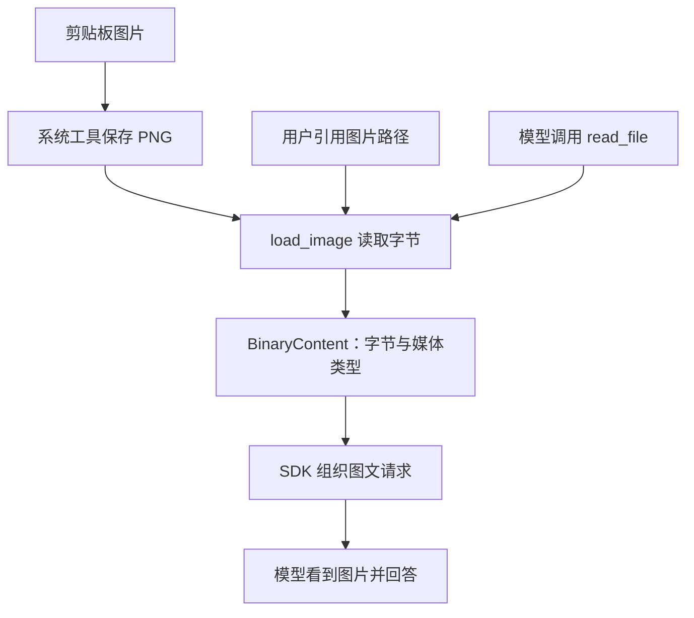

# 图片输入：截图怎样进入模型请求

本次按照你贴的文章，实现剪贴板粘贴、@ 图片引用和 read_file 读取图片。使用教程的 BinaryContent 与占位符方式，由 SDK 组装请求，没有新增第三方依赖。额外处理了历史恢复、回退与 auto 分类器，避免原来的文本逻辑把图片变成字节字符串。

## 1. 为什么要读取图片数据

原来输入只有字符串。你写 `assets/error.png`，模型得到的只是路径，不能凭这个路径访问你电脑。可以把路径理解为地址，把 BinaryContent 理解为实际拿到的文件：只给地址，模型没有拿到图片。



## 2. BinaryContent 里面存什么

[images.py](images.py) 的 load_image：

```python
data = Path(path).read_bytes()
return BinaryContent(data=data, media_type=media_type)
```

PNG 是二进制文件，不能像源码一样按 UTF-8 解码。read_bytes 取得原始字节，media_type 告诉 SDK 文件类型。

```python
BinaryContent(data=b"...原始图片字节...", media_type="image/png")
```

这个对象不是识别结果，也不是路径；识别发生在服务端模型收到图像之后。和教程一样，按扩展名判断格式，没有检查文件头或在客户端缩放图片。

## 3. Alt+V 之后发生什么

[ui/input_ui.py](ui/input_ui.py) 在 Windows 绑定 Escape + v，即终端中的 Alt+V；其他系统绑定 Ctrl+V。

按键触发 `_paste_image()`：

```python
image = await asyncio.to_thread(images.read_clipboard_image)
```

系统命令可能等待几秒，把它放进工作线程执行，输入界面和后台任务继续工作。这里没有请求模型，也没有创建持续监听器。

read_clipboard_image 的流程：

1. 选择系统工具：Windows 的 PowerShell、macOS 的 osascript、Linux 的 xclip。
2. 检查剪贴板有无图片，没有或获取失败就返回 None，界面显示提示。
3. 生成时间戳加 UUID 的 PNG 路径，存到 `~/.my-claude-code/clipboard/`。
4. 用系统命令保存图片。Windows 指定 STA 和 PNG 编码。
5. 调用 load_image，将文件读成 BinaryContent。

取得图片后：

```python
self._attachments.append(image)
self._buffer.insert_text(f"[Image #{len(self._attachments)}]")
```

此时不同位置保存不同数据：

```text
输入框：     [Image #1] 解释这个报错
附件列表：   [图片1的 BinaryContent]
```

占位符方便你编辑，实际图片在附件列表中。删除占位符，就不会发送这张图。Esc 同时清空文字和附件；若系统取图还没结束，清空之后迟到的图片也不会重新插入。

回车时，输入区快照当前附件并交给 main.on_submit，然后给新草稿换一个空列表。以后新粘贴的图片不会改动已经提交的那一轮。

## 4. @ 图片如何处理

输入：

```text
@assets/login.png 这是设计稿， @main.py 这是代码，帮我比较。
```

[mentions.py](mentions.py) 的 build_mention_messages 按类型分流：

- 文本仍走 read_and_register，构造配对的 ToolCallPart / ToolReturnPart，注入历史。
- 图片调用 load_image，放进 attachments，记录对应路径，不伪造工具调用。

replace_image_mentions 在原位置替换成功读取的引用：

```text
[Image #1] 这是设计稿， @main.py 这是代码，帮我比较。
```

如果之前已经粘贴一张图片，引用图片从 #2 开始。重复引用同一路径共用编号，但每个位置都保留图像块。路径与说明之间用空格；当前 @ 解析不支持含空格的路径，可以让模型用 read_file 读取这类路径。

## 5. 图文列表怎么交给 Agent

[main.py](main.py) 的 run_agent_loop 在 agent.iter 前转换输入：

```python
if attachments:
    user_input = images.build_user_content(user_input, attachments)
```

输入框：

```text
[Image #1] 这是什么？ [Image #2] 这个呢？
```

附件：

```python
[图片1, 图片2]  # 两个 BinaryContent
```

build_user_content 从左向右查找占位符，保留中间的文本，并原地放入对应附件：

```python
[图片1, " 这是什么？ ", 图片2, " 这个呢？"]
```

然后调用原来的：

```python
async with agent.iter(user_input, message_history=state.history, deps=deps, ...) as run:
    ...
```

传入字符串是文本输入，传入字符串/图片的有序列表是多模态输入。deps 仍保存工具的本地依赖，图片没有放进 deps。

## 6. SDK 最终生成的 API 格式

当前 SDK 的 OpenAIChatModel 遍历内容列表，对 BinaryContent 图片使用其 data_uri，生成类似请求：

```json
{
  "role": "user",
  "content": [
    {"type": "image_url", "image_url": {"url": "data:image/png;base64,图片1的编码"}},
    {"type": "text", "text": " 这是什么？ "},
    {"type": "image_url", "image_url": {"url": "data:image/png;base64,图片2的编码"}},
    {"type": "text", "text": " 这个呢？"}
  ]
}
```

这是格式示例，编码位置不是可用图片。虽然字段叫 image_url，这里使用包含图片数据的 data URI，并非外部网址。Base64 是字节的文本编码，不是识别结果。

本项目没有手工组装这段请求。测试用模拟 HTTP 捕获当前 SDK 发出的真实请求结构，验证块的顺序，以及解码后能还原相同 PNG。

## 7. read_file 返回图片怎么交给模型

[agent/tools/file.py](agent/tools/file.py) 在文本读取前增加图片分支：

```python
if images.is_image(path):
    return images.load_image(path)
```

模型调用 read_file 后，工具返回 BinaryContent。当前 Chat Completions 适配器将工具返回的图片映射到后续的 user 图像内容块，同时保留工具返回关联信息；没有把原始图片字节塞进普通 tool 文本。

图片读取忽略文本的 offset/limit，每次读完整文件；不登记到文本 ReadFileState，因此看过图片不会放开文本编辑工具覆盖二进制文件的检查。终端只显示媒体类型与大小，模型消息仍带实际图像。

## 8. 历史、回退和权限如何兼容

session.append_messages 使用 SDK 支持的序列化，图片字节以 Base64 随消息写入 JSONL；ModelMessagesTypeAdapter 在 load_history 中将它还原为 BinaryContent。/resume 不需要原图片文件继续存在。

会话标题仅提取用户文字，纯图输入显示“图片消息”。终端回放与 /api-detail 显示类型/大小，避免打印图片字节。

/rewind 截断历史前，从所选这一轮取出多模态用户消息，将它恢复为占位符和附件，再回填输入区。查找范围限定在当前检查点到下一检查点，避免误取后来另一轮的图。

auto 分类器用 prompt_text 只提取字符串，不将图片字节或图片里的指令当成人类授权。

图片历史会增加 JSONL 文件体积，原始剪贴板 PNG 也会保留。压缩仍按已有摘要机制执行，完整图片可从压缩前的历史存档恢复。

## 9. 使用与验证

先把截图放到项目 assets 目录，启动程序后试：

```text
@assets/error.png 解释这个报错，暂时不要改代码。
```

或复制图片，Windows 按 Alt+V，等占位符出现后输入问题。macOS/Linux 用 Ctrl+V，当前 Linux 取图需要 X11/xclip。再试模型主动读取：

```text
请用 read_file 查看 assets/error.png，解释其中的错误。
```

专项测试：

```powershell
.\.venv\Scripts\python.exe -X utf8 -m unittest test_images -q
```

测试不消耗模型 API，也不改变真实剪贴板。图片读取、SDK 请求映射与历史保存真实执行，HTTP 与系统剪贴板返回使用模拟；键盘通过模拟终端发送 Alt+V 的实际编码。真实系统取图和模型识别效果尚未端到端验证，可用上面三个例子检查。

阅读顺序：load_image → Repl._paste_image → main.inject_at_mentions → build_user_content → run_agent_loop → read_file 图片分支。三条来源取得图片原始数据，统一成 BinaryContent，再由 SDK 按图文顺序发送。
