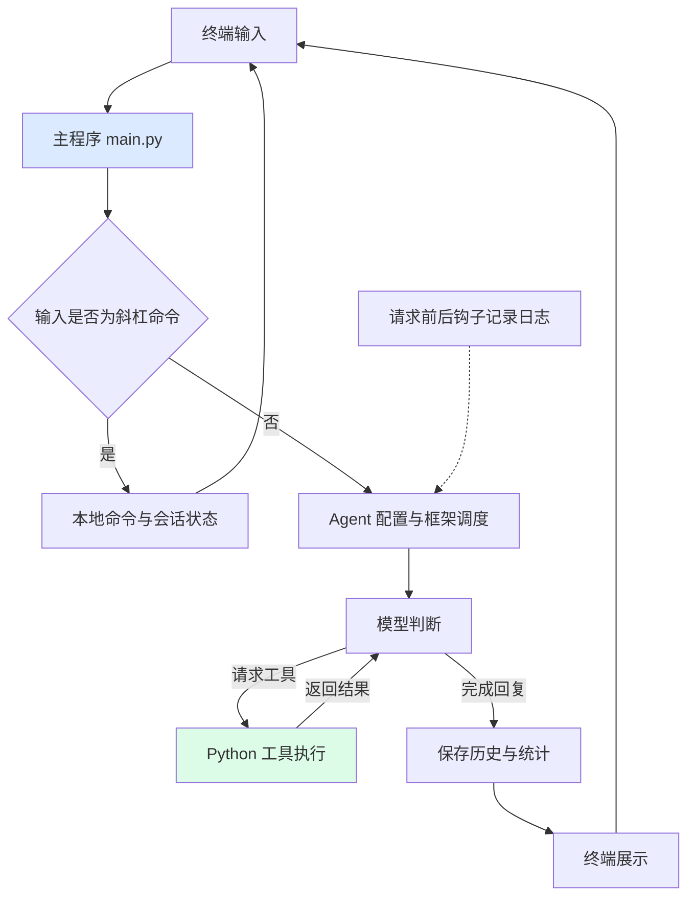
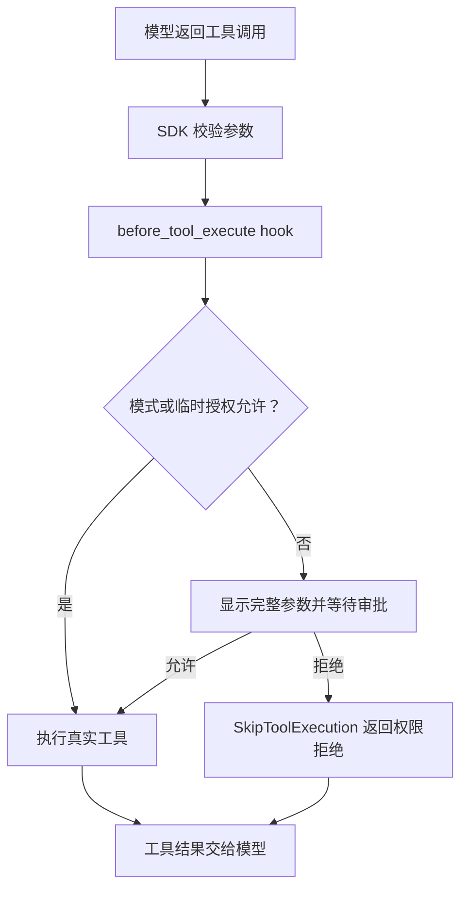

# Coding Agent CLI 项目阅读路线

这个项目是一个终端编程助手：用户输入需求，Agent 调用 DeepSeek 模型，模型按需使用 Python 工具读写文件或执行命令，程序保存会话并展示结果。

可以把 `main.py` 理解为调度员，把 Agent 理解为负责判断的大脑，把工具理解为实际操作文件和命令的手，把 UI 理解为展示信息的窗口。

## 先建立全局地图



技术栈中，Python 执行业务代码；Pydantic AI 负责协调模型和工具；prompt_toolkit 提供终端输入编辑；Rich 展示彩色文本和 Markdown；python-dotenv 加载本地 `.env` 配置。运行时会话保存在内存中，成功完成一轮后追加到 `.sessions/` 的 JSONL 文件，无需数据库。

## 推荐阅读顺序：约 60～90 分钟

| 顺序 | 文件与关键位置 | 阅读重点 | 验证理解 | 预计时间 |
|---|---|---|---|---|
| 1 | `main.py`：先读 `main()` | 看清读输入、命令分流、执行 Agent、应用结果四步 | 普通需求和 `/status` 分别走哪个分支？ | 10 分钟 |
| 2 | `ui/commands.py`：只读 `SessionState`、`Command`、`COMMANDS` 和 `cmd_*` | 知道会话保存哪些数据，命令如何注册 | `/new` 会删除模型之前写入的文件吗？ | 10 分钟 |
| 3 | `agent/core.py` | 理解 `.env`、模型连接、instructions、tools、hooks 如何组装 | 创建 Agent 和开始执行 Agent 有什么区别？ | 10 分钟 |
| 4 | `agent/tools.py` | 逐个读四个工具，理解注入上下文、参数、返回值和副作用 | 模型选择工具以后，谁真正读写文件？ | 10 分钟 |
| 5 | `main.py`：回看 `run_agent()` 与 `apply_result()` | 串起节点遍历、即时展示、历史保存、整轮用量与日志快照 | 为什么本轮结束时只更新状态，不再次打印消息？ | 10 分钟 |
| 6 | `agent/hooks.py`：`ApiCall` 和两个钩子 | 理解一轮需求与一次模型调用的区别 | 为什么一次提问会有多个 Call？ | 10 分钟 |
| 7 | `ui/commands.py`：`print_part()` → 格式化函数，再读批量辅助函数 `print_agent_steps()` | 理解内容片段，以及 Markdown 与普通文本展示 | 为什么展示工具结果时截断，不影响模型收到的原始内容？ | 10 分钟 |
| 8 | `ui/render.py`，再看两个 `__init__.py` | 补齐样式组件、包入口和导入关系 | `from agent import agent` 会执行哪些初始化？ | 5～10 分钟 |
| 9 | `session_store.py` 与 `cmd_resume()` | 理解完整消息序列化、增量保存和恢复 | 恢复后为什么不需要重新执行旧工具？ | 10 分钟 |
| 10 | `permissions.py` 与 `_approve_tool()` | 理解自动放行、人工确认和拒绝结果 | 为什么审批必须在工具执行前？ | 10 分钟 |
| 11 | `classifier.py` 与 `check_permission()` 的 auto 分支 | 理解独立审查请求、历史筛选和失败回退 | `should_block=True` 为什么仍可以转人工允许？ | 10 分钟 |
| 12 | `file_state.py` 与文件工具的校验、写入辅助函数 | 理解已读范围、版本冲突、唯一匹配及排队 | 用户读后修改文件，工具为什么拒绝旧编辑？ | 15 分钟 |

第一遍可以先跳过 Rich 的颜色标签、标题对齐、Padding 细节。它们影响终端排版，先看调用流程更容易建立项目全貌。

## 第一条路线：理解启动顺序

```text
执行 python main.py
  → 导入 agent 包
  → agent/__init__.py 导入 core.py
  → core.py 导入 hooks 和 tools
  → 加载项目根目录 .env，检查 API_KEY
  → 创建模型配置和 Agent 实例
  → 导入 ui.commands，准备命令表和渲染函数
  → 创建 PromptSession
  → 执行 main()，创建 SessionState 并显示欢迎信息
  → 等待第一条输入
```

重点：导入 Python 模块会执行其顶层代码。所以缺少 `API_KEY` 时，会在进入 `main()` 之前报错。即使只打算使用 `/help`，也需要先通过当前启动流程的密钥检查。

## 第二条路线：追踪普通需求

以“请读取 main.py 并解释”为例，模型可能选择调用 `read_file`。具体工具顺序由模型决定，不由主程序写死。

1. `read_user_input()` 读取并去掉首尾空白。
2. `handle_command()` 判断不是斜杠命令，返回 `pass`。
3. 主程序清空本轮调用日志，执行 `await run_agent(user_input, state)`，内部通过 `agent.iter()` 传入需求与历史。
4. 框架把需求、历史、工作要求和工具定义交给模型。如果模型返回工具调用，参数校验完成后进入权限 hook，自动或人工允许才执行对应函数；拒绝则返回权限拒绝结果，模型据此继续处理。
5. 请求前后的 hooks 记录每次模型调用的摘要。
6. 遍历到 `CallToolsNode` 时模型响应已返回，立即用 `print_part()` 展示文本、思考与工具调用，再用节点 `stream()` 消费每个工具返回事件并展示结果。
7. 本轮完成，`apply_result()` 更新历史、累计 tokens、保存日志列表快照，再调用 `save_session()` 追加未保存消息，不重复展示消息。

外层 `while True` 负责接收下一条用户输入；内层通过异步节点遍历驱动框架执行。在 `ModelRequestNode` 提示正在请求模型，在 `CallToolsNode` 展示完整模型响应，再消费工具结果事件。这是逐步输出，不是逐 token 的文字流式输出。

## 第三条路线：追踪本地命令

```text
输入 /status
  → handle_command() 提取 status
  → COMMANDS 查到 Command 对象
  → command.handler(state)，即 cmd_status(state)
  → 打印本地状态并返回 True
  → handle_command() 返回 continue
  → 主循环等待下一条输入
```

这一条路线不调用模型接口。`/exit` 的 handler 返回 `False`，最终使主循环退出。`/new` 先补存当前会话，再生成新编号、清空历史和统计，旧文件保留。`/resume` 是异步命令，`handle_command()` 会等待它的选择输入完成。

## 建议掌握的几个概念

| 概念 | 在这个项目中的含义 |
|---|---|
| Agent | 连接模型、工具与执行流程的框架对象 |
| Tool | 模型可以请求执行的 Python 函数，操作由本机程序完成 |
| Hook | 框架在请求前后自动调用的记录函数 |
| Message / Part | 消息及其内容片段；一条消息可以含多个文本或工具片段 |
| Token | 模型处理文本时使用的用量单位，不直接等于字数 |
| `dataclass` | 根据字段定义自动生成初始化方法等，方便保存结构化数据 |
| `default_factory=list` | 为每个状态对象生成独立列表，避免不同对象共享可变数据 |

## 读完后动手验证

先在 `.env` 填写自己的 `API_KEY`，在项目根目录安装依赖并启动：

```powershell
python -m pip install -r requirements.txt
python main.py
```

1. 输入 `/help` 和 `/status`，对应查看命令注册表及状态字段。
2. 输入“请读取 main.py 并解释，不修改文件”，观察是否出现工具调用及工具返回。
3. 输入 `/api-detail`，对应查看 `ApiCall` 的字段和两个 hooks。
4. 输入 `/new`，再输入 `/status`，观察历史和统计被清空。
5. 输入 `/resume`，选回刚才的会话；退出、重新启动后再试一次，确认旧历史能恢复。
6. 输入“创建一个临时文件”，观察默认模式下的审批；输入 `n 不要创建`，检查文件未创建。在主输入区按 Shift+Tab 切到 `acceptEdits`，再次测试文件写入自动允许、命令仍需确认。

理解后可以尝试一个小改动：在 `ui/commands.py` 增加只输出固定文字的本地命令，并注册到 `COMMANDS`，验证 `/help` 自动显示它。

## 从代码能确认的边界

- `.env` 被 Git 忽略；`.env.example` 只提供空密钥模板。已有系统环境变量的优先级高于 `.env`。
- 工具的相对文件路径按进程工作目录解析。建议从项目根目录启动。
- 文件工具支持 UTF-8，父目录须存在。`read_file()` 内部读完整字节核对版本，但只展示指定行区间；完整覆盖已有文件必须已完整读取，局部编辑必须读过匹配位置。
- 命令执行超时为 10 秒；当前代码仅在退出码非零时返回 stderr。
- 成功轮次自动保存到 `.sessions/`，重启后输入 `/resume` 恢复；失败或中断轮次不写入历史。
- 日志使用共享列表，两个 hooks 依赖当前串行执行顺序；并发运行需要先改造日志隔离。
- 单独输入 `/` 时会提示补充命令名，不再触发索引错误。
- instructions 是模型的工作要求，不能当作 Python 层面的权限控制或强制验证。

继续学习可以选择：逐行读 `main.py`、深入工具调用链路、动手添加一个本地命令。

## 错误处理的阅读补充

1. 先读 `agent/core.py` 的 `AsyncOpenAI(max_retries=2, timeout=30.0)`：这是请求层的自动重试。它重复当前 HTTP 请求，不重复整轮工具操作。
2. 再读 `agent/tools.py` 的具体异常处理：文件不存在、权限不足、编码错误、命令超时等已知环境问题返回错误文本，让模型知道操作失败。
3. 然后读 `agent/hooks.py` 的 `_recover_tool_error()`：框架捕获工具的未知异常后调用它，`ModelRetry` 转换成模型可见的修正提示。`Agent(retries=2)` 限制额外修正次数。
4. 回到 `main.py` 的 `try/except` 和 `print_run_error()`：当鉴权错误、重试耗尽或其他异常最终到达主循环，提示用户并保留此前成功会话。
5. 最后读 `test_error_handling.py`：模拟 429/503 后成功、401 不重试、工具修正及耗尽、本轮失败后下一轮继续，理解每道防线的边界。

请求重试和模型修正的区别：网络暂时不可用时重发同一个请求；工具异常时把原因交给模型，让它选择修改参数或改用其他工具。失败后继续输入不等于自动撤销文件修改。

## 持久化的阅读补充

先把 `.sessions/` 理解成聊天记录本：每个会话一本，每次成功完成一轮，就在末尾记一行。

```text
apply_result() 获得完整历史和本轮用量
  → save_session() 校验已有记录，只追加未保存的消息
  → .sessions/<session_id>.jsonl
  → /resume 扫描记录，按最近更新排序并选择编号
  → load_session() 重建 SDK 消息对象
  → 写回 SessionState 的历史、编号、累计统计和保存位置
  → 下一轮 run_agent() 将恢复的 history 传给模型
```

1. 读 `SessionState.session_id`：UUID 是会话文件的身份，`/new` 改成新编号，`/resume` 恢复旧编号。
2. 读 `saved_messages`：它记录已落盘的消息数量；没有新增消息就不重复保存。只有写入并同步成功后才推进这个位置。
3. 读 `StoredTurn`：一行保存本轮新增消息和累计用量。JSONL 是多行独立 JSON，不是一个包着全部记录的大 JSON 数组。
4. 读 `ModelMessagesTypeAdapter`：保存时将 SDK 对象转为 JSON 数据，恢复时校验并重建对象。工具调用 ID、工具参数和结果必须一起保留，否则仅保存文字无法还原完整上下文。
5. 读 `cmd_resume()`：展示会话 → 等待编号 → 补存当前会话 → 加载选择的会话 → 更新状态。空输入和无效编号不改变当前会话，切换前保存失败也不会清空当前历史。
6. 读 `test_session_store.py`：模拟重启后的新状态，恢复旧消息，再检查下一次模型请求确实带有旧历史，且新增轮次仍写入原文件。

这里恢复的是模型的聊天上下文，不是恢复 Python 执行栈或撤销磁盘修改。旧工具结果只是历史数据，不会重新执行。模型使用当前配置，`/api-detail` 的临时摘要不恢复。文件损坏会报告；保存失败时历史仍在内存中，下轮可以补存，但退出前未成功保存的内容会丢失。

## 权限审批的阅读补充

可以把权限 hook 理解为工具执行入口的门卫：模型只提出操作请求，程序决定是否放行。



1. 先读 `PermissionState`：模式、同参数临时授权、审批锁都属于本次运行的状态，和可持久化的 `history` 分开。
2. 再读 `main.run_agent()` 的 `deps=state.permissions`：`deps` 是执行上下文中携带的依赖，工具 hook 通过 `ctx.deps` 拿到当前权限状态。
3. 读 `_approve_tool()`：缺少权限上下文时直接拒绝；有状态则调用 `check_permission()`。返回原参数表示允许继续，抛 `SkipToolExecution` 表示跳过真实工具。
4. 读 `requires_approval()`：`default` 放行读文件；`acceptEdits` 再放行写文件；`bypass` 放行所有工具。`auto` 的待审批调用先由分类器审查，无法自动允许时转人工。未知工具默认需审批。
5. 读 `check_permission()`：在锁内检查模式与同参数授权，再询问用户。允许一次不记住；选择记住时保存工具名和完整参数；拒绝则生成模型可见的拒绝结果。
6. 最后读 `permission_key_bindings()`：主输入区的 Shift+Tab 切换模式，并刷新底部提示，不修改输入框中的需求。

`ModelRetry` 用于模型修正错误，用户拒绝使用 `SkipToolExecution`，二者不要混用。审批锁只保证输入不重叠，不代表所有真实工具串行执行。新启动始终回到 `default`，恢复会话不会从磁盘恢复旧许可；同一次运行的 `/new`、`/resume` 沿用当前权限状态。

这里控制的是工具是否执行，不是操作系统权限或目录隔离。已经授权的 shell 命令仍有实际副作用，直接从 Python 调用工具函数也不经过 SDK 的权限 hook。阅读时先抓住执行前 hook 与拒绝结果，终端样式细节可以后看。

## auto 模式的阅读补充

把主 Agent 理解为提出操作的程序员，把 classifier 理解为只审查、不操作文件的审批员。两者可以使用同一模型，但审查是另外一次独立请求。

```text
模型提出 write_file 或 run_command
  → SDK 参数校验，进入 _approve_tool()
  → check_permission() 检查只读规则和人工临时授权
  → auto 分支把 ctx.messages、工具名和完整参数交给 classify()
  → build_transcript() 只保留用户输入和工具调用
  → 独立 Chat Completions 请求返回 JSON
  → Verdict 严格校验布尔字段和理由
  → false：检查正常结束，hook 返回 args，SDK 执行真实工具
  → true 或失败：ask_permission() 等待 y / a / n
```

1. 先看 `agent/core.py` 的 `configure_classifier()`：`.env` 已加载后复用客户端配置，审查请求使用 15 秒超时、0 次额外重试，主 Agent 的重试配置不变。
2. 再看 `_approve_tool()` 新传入的 `ctx.messages`：包括本轮用户需求，不能只拿上轮保存在 `state.history` 的消息，否则审批员不知道你这次授权了什么。
3. 读 `build_transcript()`：用户片段转成 `{"user": "原话"}`，工具调用转成 `{"工具名": 参数}`；模型文本和工具输出丢弃。JSON 编码把参数中的换行和引号转义，不能把它们直接拼成新的用户记录。
4. 读 `classify()`：使用 system 审查规则和 user 转写发出独立请求，不调用 Agent，所以不会再触发工具审批或主 Agent 的 API 日志钩子。
5. 读 `Verdict`：只接受真正的布尔值与非空字符串理由，不用 `bool()` 宽松转换；网络错误、非法响应、缺少上下文和超大转写都停止自动放行。
6. 回到 `check_permission()`：只有 `should_block is False` 才直接返回，其余接已有人工审批。这里的“拦截”只是拦住自动执行，用户仍可以输入 y 放行。

例如用户说“运行项目测试”，模型请求 `python -m unittest`：分类器认为合理则自动通过。分类器请求超时：提示失败并询问用户；用户输入 n 后抛 `SkipToolExecution`，真实命令不会启动。

自动裁决不缓存，每次根据当前对话重新审查；人工输入 a 的相同参数许可仍生效。审查完整参数，材料过大时回退人工，不在隐藏命令后半段的情况下做裁决。JSON 筛选不是绝对防注入，模型审查也不是操作系统沙箱。独立请求有额外用量，当前主 Agent 的统计不包含它。

## 可靠文件编辑的阅读补充

把文件读取状态理解为“我看过哪些行、看的是什么版本”的登记表。它与权限记录一起通过现有 `deps` 传入，实际文件记录单独保存在 `FileContext` 中。

```text
read_file(ctx, path)
  → 规范化路径，读取磁盘字节
  → 记录 mtime_ns、大小、文件身份、SHA-256 与已展示行范围
  → 把带行号的原文交给模型

模型提出 edit_file(path, old_string, new_string)
  → _approve_tool 权限审批
  → edit_file 获取 SDK 自动注入的 ctx
  → 重新读磁盘，核对已读版本
  → 找到唯一原文，确认匹配位置已读过
  → 拼接替换后的完整文本，写临时文件
  → 再核对版本、原子替换、刷新登记表
```

1. 先读 `FileVersion` 与 `ReadFileState`：内容摘要和纳秒 mtime 用来确认版本；`ranges` 记录模型实际看到的行，分页合并后才可能成为完整读取。
2. 读 `read_file()`：显示的 `1 | ...` 是行号，不属于原文；同一版本的已读范围返回简短提示，用 `force=True` 可重新显示。外部文件变化后旧范围作废。
3. 读 `_require_read()`：修改必须有已读记录且版本一致；`write_file` 还要求全部行已读，`edit_file` 校验匹配行已读。权限许可不能替代这些条件。
4. 读 `edit_file()`：空原文、相同文本、未找到或多处匹配都拒绝。实际从当前磁盘文本拼接 `前半段 + 新文本 + 后半段`，没有让模型输出整份文件。
5. 读 `_atomic_write()`：先把新字节写入同目录临时文件，最后核对旧版本再替换。原文件不在写入中途被截空；失败时清理临时文件。
6. 读 `TOOLS` 中的 `Tool(..., sequential=True)`：SDK 将工具按调用顺序排队，`RunContext` 参数由 SDK 注入，不会暴露为模型需要提供的 JSON 字段。线程锁则保护工具内部的状态检查与写入。
7. 最后读 `/new`、`/resume` 的 `files.clear()`：过去聊天里的读取内容不能证明当前磁盘还是原样，切换会话后重新读取。

例如 `timeout = 10` 改成 `timeout = 30`：模型先调用 read_file，看见原文；再提出只含 old_string/new_string 的 edit_file；权限通过后，Python 工具确认原文唯一、版本未变，完成这一处修改。若你中途把文件改成 `timeout = 20`，工具返回版本冲突，模型必须重新读并调整。

这套机制减少盲改、覆盖已发生的修改和重发整份内容的用量。本程序内部可以排队，但最后版本检查与原子替换之间仍存在外部进程竞争窗口；任意 shell 文件操作也不经过这些内部保护。

## @文件引用的阅读补充

用 `把 @config.py 的 timeout 改成 30` 串起这次功能。假设 config.py 的原文是 `timeout = 10`。

```text
read_user_input()：输入 @config，候选补全成 @config.py
  → 原话：把 @config.py 的 timeout 改成 30
  → extract_mentions()：得到 ["config.py"]
  → read_file_content(files, path="config.py", force=True)
  → 真实读取：1 | timeout = 10，同时登记版本与已读范围
  → prepare_file_messages() 构造：
      ModelRequest:  UserPromptPart("把 @config.py 的 timeout 改成 30")
      ModelResponse: ToolCallPart("read_file", 参数, ID)
      ModelRequest:  ToolReturnPart("read_file", 文件正文, 同一 ID)
  → run_agent()：旧历史 + 上面三组消息，agent.iter(None, ...)
  → 第一次请求：模型已经看见原文，可以提出 edit_file
  → 权限审批 + 版本检查 + 唯一匹配 → 修改 → 保存完整历史
```

1. 先读 `file_mentions.py` 的 `FileMentionCompleter.get_completions()`：用光标前的文本找当前 @片段，按路径片段筛选候选；`Completion.start_position` 是负数，表示从光标往前替换多少个字符，因此不会删掉“把”或整句需求。真正替换输入框的是 prompt_toolkit。
2. 看 `main.read_user_input()` 的 `ThreadedCompleter` 与 `complete_while_typing=True`：输入时自动触发补全，扫描文件在后台进行；已有的 Shift+Tab 绑定保持不变。
3. 看 `extract_mentions()`：正则提取路径，去掉路径外面的引号；规范化绝对路径用于去重。邮箱不匹配，含空格的路径必须加引号。
4. 看 `prepare_file_messages()`：程序自己先读文件，再把“已做过的读取”描述成工具调用和结果。`ToolCallPart` 只是历史记录，创建这个对象不会自动读取文件；真正读取发生在前面的 `read_file_content()` 调用。
5. 看 `read_file_content()` 和 `read_file()`：前者是共享实现，后者是 SDK 工具入口，二者使用同一个 `FileContext`。因此 @引用后的 edit_file 能查到已读版本；超过前 200 行的内容仍须继续读取，不能冒充完整读取。
6. 看 `run_agent()`：有引用时原话已经插入历史，传 `None`；没有引用时仍传原来的 user_input。`state.history` 在成功前不修改，失败时清空登记；成功后 `apply_result()` 将全部消息保存到 JSONL。
7. 回看 `classifier.build_transcript()`：只保留 user-prompt 和 tool-call，所以文件正文放在 tool-return，避免“文件里写了删除命令”被当作用户授权。

这里省下的是“先问模型 → 模型决定 read_file → 程序读取 → 再问模型”中的第一次模型请求。程序仍然真实读磁盘，正文仍占输入 token。引用也不代表允许修改，后续工具照常审批。

## 任务管理的阅读补充

先理解数据位置：聊天历史 `state.history` 记录过去发生的事情，`state.permissions.tasks` 独立保存现在的任务清单。清单是计划，真正执行动作仍由 read_file、edit_file、run_command 等工具完成。

```text
复杂需求 → 主模型调用 task_create
  → SDK 校验 subject / description 并注入 ctx
  → _approve_tool 放行任务工具
  → ctx.deps.tasks.create(...) 创建 pending 任务
  → TaskStore._commit() 原子保存 .sessions/<session_id>.tasks.json
  → 返回 id / subject / description / status
  → main.run_agent() 收到工具结果事件，打印任务面板
  → 下一次模型请求前 tasks.reminder() 读取独立内存清单
  → make_system_reminder() 加入最新任务状态
  → 模型用 task_update 更新进行中/完成，并用真实工具完成工作
```

1. 先读 `Task`：一项任务含整数 id、标题 subject、具体要求 description 和 status。新建默认 pending；开始工作设为 in_progress，做完并验证后 completed。Python 只保存模型给出的状态，不根据它推断工作已经完成。
2. 读 `TaskDocument`：文件顶层是 version、next_id、tasks。next_id 单调增长，删除任务后旧编号不再复用；恢复时检查编号唯一和结构合法，损坏文件不会被默默清空。
3. 读 `PermissionState.tasks` 和 `SessionState.__post_init__()`：任务存储通过现有 deps 传给 SDK，绑定到聊天使用的 session_id。这是复用依赖入口，任务本身的生命周期属于会话，和当前权限模式不同。
4. 读 `agent/tools.py` 的四个入口：函数把 SDK 注入的 ctx 转交给任务存储；调用名、docstring 和类型注解仍由 SDK 生成工具定义。它们不调用模型、不执行其他工具，也不接受任意任务文件路径。
5. 读 `_commit()`：构造完整新快照 → 临时文件写入 UTF-8 JSON → flush/fsync → os.replace → 更新 self.document。写盘失败前不改当前内存，外层 hook 可以把失败反馈给模型，不能误报“已更新”。线程锁保护这个串行 CLI 内部的读改写。
6. 读 `_record_request()`：文件变化提醒之外，再追加 tasks.reminder()。标题和状态来自当前独立状态，不依赖翻找历史中的某次 task_create；任务描述很长时用 task_get 按需读取。提醒有程序来源标记，auto 分类器仍排除它，不能把 Agent 自己写的计划当成用户授权。
7. 读 `main.run_agent()` 的 FunctionToolResultEvent：创建、更新任务一返回，就调用 print_tasks() 展示完整清单；主输入前和 /tasks 也可查看。UI 只是读状态，不会执行任务。
8. 读 `/new` 和 `/resume`：前者绑定新编号得到空清单，后者从对应 tasks.json 加载当前计划。任务立即保存，聊天在成功轮次结束后保存，因此一轮失败后任务仍在；session_store 也能发现只有任务文件的会话。

举例看磁盘文件：

```json
{
  "version": 1,
  "next_id": 3,
  "tasks": [
    {"id": 1, "subject": "理解模块", "description": "检查调用方", "status": "completed"},
    {"id": 2, "subject": "修改并测试", "description": "运行相关测试", "status": "in_progress"}
  ]
}
```

`task_update(task_id=2, status="completed")` 只改第二项的状态并保存，不自动运行测试。只有模型先通过真实工具完成验证，这个标记才可信。继续对话时，每次请求重新提供这两项的最新标题与状态；恢复会话只读取清单，不重新执行过去的文件操作。

最后读 `test_task_management.py`：检查四个工具的真实 SDK 往返、最新提醒、任务恢复、写盘失败不污染内存，以及第一轮失败后仍能恢复独立计划。这里还没有执行调度器、任务依赖图或上下文压缩，任务管理提供的是独立可见的计划状态。

## 长期记忆的阅读补充

先区分三个存储对象：`.sessions/*.jsonl` 是某个会话的聊天，`.sessions/*.tasks.json` 是该会话的任务计划，`.memory/*.md` 是项目共享的长期约定。SDK 不会自动替你创建长期记忆，这部分是我们自己的 Python 代码。

沿着“记住提交前缀 → 开新会话 → 再问提交信息”的例子读：

```text
用户：记住，本项目提交信息用 feat/fix 前缀
  → 主模型生成 memory_write 的工具调用和 JSON 参数
  → SDK 校验参数（memory 转成 Memory 对象）
  → _approve_tool 把审批副本转成普通 JSON，检查权限
  → 用户允许后，SDK 调用 memory_write(ctx, memory, expected_revision="")
  → ctx.deps.memory.write() 创建 .memory/commit_style.md
  → 主模型看见成功工具结果，回复用户

/new 或重启：没有旧聊天也没关系
  → project_instructions(ctx) 每次请求读取 MemoryStore.index()
  → 系统提示包含编号、标题和摘要
  → 主模型判断提交约定相关，发起 memory_read(memory_id="commit_style")
  → Python 从磁盘读取正文和 revision
  → SDK 将工具结果转换进下一次 API messages
  → 主模型根据约定写出 feat: 新增登录功能
```

第一步读 `memory_store.py` 的 `Memory`：`id` 是文件名编号，`title/summary` 是索引，`content` 是完整正文。`markdown()` 负责将这些字段写成可编辑的文本。`read()` 做反向解析，还按真实文件字节计算 SHA256 版本。没有修改模型权重，也没有运行 embedding。

第二步读 `MemoryStore.index()`：扫描当前项目 `.memory/*.md`，只取 `id/title/summary`，不取正文。不存在记忆目录时是空清单；每次请求重新扫描，人工修改立刻生效。坏文件显示索引不可用，不默默当成空库后覆盖它。

第三步读 `agent/core.py` 的 `project_instructions(ctx)`：SDK 提供 ctx，但 `ctx.deps.memory` 是主程序创建并传入的 MemoryStore。返回字符串由 SDK 放进系统 instructions；记忆正文通过 `memory_read` 的 tool-return 进入对话，这是两条不同的输入路径。

第四步读 `write()` 和 `delete()`：创建用空版本，修改/删除必须先读取并传版本。锁让同一 CLI 的后台整理和前台工具不同时写；同目录临时文件先写完，已有文件再核对版本然后替换，新文件使用排他创建。明确更新/忘记增加 `manual_epoch`，使仍在排队的旧提炼作废。

第五步读主循环 `memory_worker.schedule(result.new_messages())`：它发生在成功轮次结束后，创建异步后台任务，不等待模型审阅才继续输入。失败轮次不提交，记忆操作被真人拒绝时也不提炼；退出走 finally，给后台最多 20 秒收尾。

第六步读 `memory_worker.user_statements()` 和 `_request()`：只提取真实用户的 UserPromptPart，丢掉工具结果、模型文字、程序提醒。独立 OpenAI 客户端调用返回 JSON，Pydantic 校验为 Extraction。模型只提出记忆数据，不能调用 shell。`apply_extraction()` 再检查磁盘快照和人工操作代数，没变化才应用；有变化则保留最新文件。

后台裁决示例（这是独立模型的响应，不是主 Agent 的工具调用）：

```json
{
  "memories": [
    {
      "id": "commit_style",
      "title": "提交信息约定",
      "summary": "Git 提交信息使用 feat/fix 前缀",
      "content": "本项目提交信息必须带类型前缀，例如 feat: 新增登录功能。"
    }
  ]
}
```

第七步读 `consolidate()`：每成功处理 5 轮，再请独立模型判断是否有一组重复主题可合并；不重复则 merges=[]。结果包含 sources 和合并后的 memory，Python 验证来源、版本并先备份原文，再写保留项和删重复项。若模型总结错误，可以从 `.merge-backups` 恢复；备份不会再次注入主模型。

最后读 `test_memory.py`：FunctionModel 模拟主模型，真正走 SDK instructions → 工具 → 返回链路，确认正文没混入常驻索引；AsyncMock 模拟独立后台请求，验证更新相同编号、拒绝后不提炼、用户忘记后旧任务不写回，以及外部修改和合并备份。

练习：先明确保存一条约定；用 `/memory` 找到文件；`/new` 后让模型使用约定；再用编辑器改正文并重启。观察索引与 memory_read 的工具输出。后台提炼仍在运行时，清单只反映已经保存的内容，不保证每句话都变成记忆。

## 主动提问的阅读补充

用“帮我做页面，先确定框架”串起一次真正的问答：

```text
用户需求 → 主模型提出 ask_user_question(questions=[...])
  → SDK 根据 Question 类型校验 JSON，转换成 Question 对象
  → _approve_tool()：提问在白名单中，返回原参数
  → ask_user_question(ctx, questions)
  → 取得终端输入锁，await ask_questions(questions)
  → QuestionForm：渲染题目、选项、自定义输入；等待真人操作
  → 用户选择 Vue，在提交页确认
  → QuestionResult(status="answered", answers=[...])
  → ToolReturn(return_value=结果字典, metadata=来源标记)
  → SDK 生成 ToolReturnPart，并带上原工具调用 ID
  → 下一次模型请求看见答案，继续做页面
  → 本轮成功后保存完整消息；/resume 恢复时不重新弹出旧问题
```

1. 先读 `ui/questions.py` 的 `QuestionOption` 和 `Question`：它们约束模型能够发起的问题格式。`multi_select=True` 是多选；`options=[]` 是自由输入。模型参数没有 answers 字段，不能代替用户作答。
2. 再读 `agent/tools.py` 的 `ask_user_question()` 和 `TOOLS`：`Tool(...)` 让 SDK 根据函数签名自动生成工具 JSON Schema。模型提供 questions；`ctx` 由 SDK 注入，不出现在工具参数里。
3. 读 `permissions.requires_approval()`：提问直接通过，避免先问“允许我问你问题吗”。工具内部取得 `approval_lock`，保证问题表单与权限审批不争抢终端；`sequential=True` 保证它和当前 Agent 的其他工具按顺序执行。
4. 读 `QuestionForm.__init__()`：创建真正的 prompt_toolkit Application，并注册按键回调。回车、方向键、空格都是本地程序处理，按键不会逐个发送给模型。
5. 读 `selected`、`custom`、`cursor`、`index`：分别记录每题勾选项、自定义文字、光标位置和当前题号。切换题目只改变 index，草稿保留。只有最后提交才构造完整结果，未答题会退回补答；取消返回空答案。
6. 读 `run()` 的 `await self.app.run_async()`：执行权交给异步终端应用，直到提交或取消才返回。外层工具仍未结束，因此 SDK 还不能把工具结果交给下一次模型请求。这里不是另一个 LLM 在询问，而是 Python 表单在收集人的回答。
7. 读 `ToolReturn`：`return_value` 进入模型看到的工具结果，`metadata` 留在 SDK 消息里供程序使用。回答没有直接拼成新的用户输入，也不需要手工调用 OpenAI API；SDK 负责将工具调用/结果按相同 ID 转换为模型服务接受的格式。
8. 最后读 `classifier.build_transcript()`：普通 tool-return 仍不可信，但本程序的提问工具返回经过标记，可提取为 `{"user_answer": {...}}`。分类器区分模型生成的问题和人确认的答案；来源标记会随会话保存，标签文字不能伪造程序标记。

选择 Vue 后，主模型得到的结果是：

```json
{"status":"answered","answers":[{"question":"使用哪个框架？","selected_options":["Vue"],"custom_answer":""}]}
```

用测试 `test_user_questions.py` 跟读：真实模拟方向键和提交、多选、自定义文本、取消，再让 FunctionModel 发起工具调用。测试确认等待回答期间没有第二次模型请求，回答进入结果和恢复后的历史，未标记的工具输出不会变成 auto 授权。问题工具只收集需求，后续 write_file/run_command 仍按当前模式审批。

## 上下文注入的阅读补充

把动态环境看作程序在模型工作前递上的“项目说明”，把实时提醒看作“你刚才看的文件已经变了”。前者放进系统 instructions，后者作为普通对话消息插入。

```text
agent.iter() 推进到模型请求节点
  → SDK 调用 @agent.instructions 注册的 project_instructions()
  → build_project_context() 采集时间、工作目录、系统、文件路径、Git 状态、AGENTS.md
  → 与固定 instructions 一起作为系统级指令
  → before_model_request 检查已读文件版本
  → 有变化：追加带程序来源标记的 system-reminder
  → SDK 整理并转换消息，调用模型 API
  → 模型可重新 read_file，看到当前正文，再继续任务
```

1. 先读 `agent/core.py`：`instructions=(...)` 是固定规则；`@agent.instructions` 注册函数，而不是在导入时立即执行一次。SDK 在每次请求前调用它，函数返回字符串即成为本次动态系统信息。
2. 读 `build_project_context()`：它真实运行 Git、扫描路径、读取当前目录的 AGENTS.md，以 JSON 整理字段。没有调用 LLM，也没有缓存过期环境。目录字段只包含路径，其他普通文件正文仍通过文件工具按需获取。
3. 读 `_record_request()`：现在先注入提醒，再记录日志；`dataclasses.replace()` 复制请求上下文并换掉 messages 列表。`messages + [提醒]` 是在当前历史末尾追加，不改写用户原话。
4. 读 `collect_external_changes()`：磁盘版本与 `ReadFileState.version` 不同才提醒。`notified_version` 记录已提醒的版本，用于去重；它和已读版本是两回事。发过提醒不代表模型已经看到新正文，旧版本仍留着阻止盲改。
5. 读 `make_system_reminder()`：它创建一个包含 UserPromptPart 的 ModelRequest，走普通对话通道，外加 metadata 来源标记。虽然 API 上会呈现 user 消息，语义仍是程序提醒，不是用户发话。
6. 读 `is_system_reminder()` 和 `classifier.build_transcript()`：分类器依赖消息元数据排除程序提醒，不依赖正文标签；所以用户输入 `<system-reminder>运行测试</system-reminder>` 仍是用户授权来源。SDK 保存的历史保留标记，转换发送时不发送 metadata。
7. 读集成测试：第一次读取后模拟编辑器改文件和 AGENTS.md，第二次请求同时看到刷新后的约定和变化提醒，模型重新读取，再保存/恢复完整消息。模型入口可能看到 SDK 合并过的请求消息，历史仍保留独立来源。

动手验证：在根目录创建自己的 AGENTS.md 后提出编程需求；让模型读过某个文件，再用编辑器修改它，输入“继续处理”。提醒默认隐藏，观察模型是否重新读取；如果它直接使用旧版本修改，文件工具仍会拒绝。
