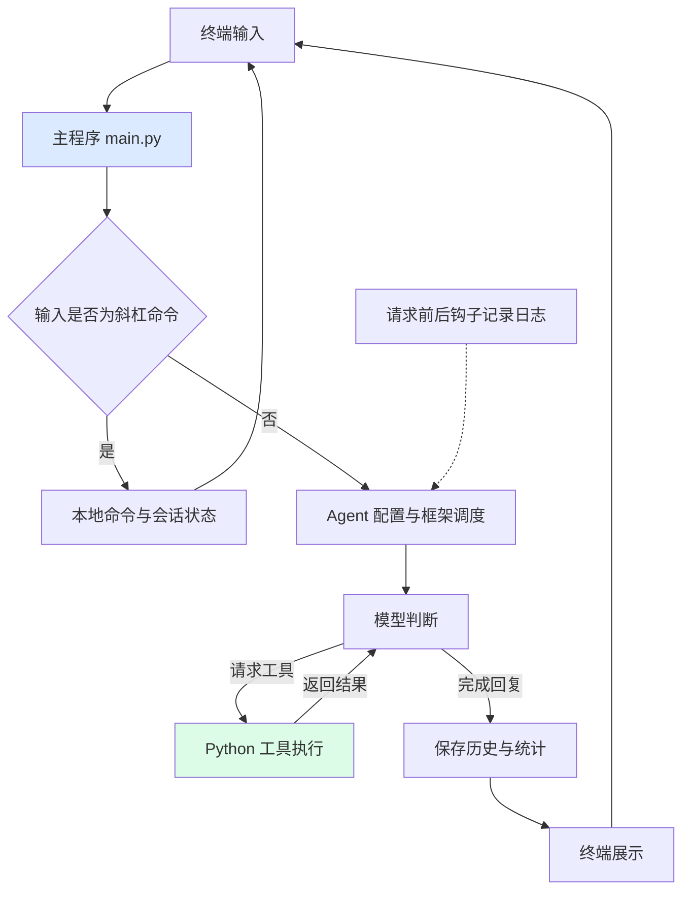

# Coding Agent CLI 项目阅读路线

这个项目是一个终端编程助手：用户输入需求，Agent 调用 DeepSeek 模型，模型按需使用 Python 工具读写文件或执行命令，程序保存会话并展示结果。

可以把 `main.py` 理解为调度员，把 Agent 理解为负责判断的大脑，把工具理解为实际操作文件和命令的手，把 UI 理解为展示信息的窗口。

## 先建立全局地图



技术栈中，Python 执行业务代码；Pydantic AI 负责协调模型和工具；prompt_toolkit 提供终端输入编辑；Rich 展示彩色文本和 Markdown；python-dotenv 加载本地 `.env` 配置。这里没有数据库，会话保存在进程内存中。

## 推荐阅读顺序：约 60～90 分钟

| 顺序 | 文件与关键位置 | 阅读重点 | 验证理解 | 预计时间 |
|---|---|---|---|---|
| 1 | `main.py`：先读 `main()` | 看清读输入、命令分流、执行 Agent、应用结果四步 | 普通需求和 `/status` 分别走哪个分支？ | 10 分钟 |
| 2 | `ui/commands.py`：只读 `SessionState`、`Command`、`COMMANDS` 和 `cmd_*` | 知道会话保存哪些数据，命令如何注册 | `/new` 会删除模型之前写入的文件吗？ | 10 分钟 |
| 3 | `agent/core.py` | 理解 `.env`、模型连接、instructions、tools、hooks 如何组装 | 创建 Agent 和开始执行 Agent 有什么区别？ | 10 分钟 |
| 4 | `agent/tools.py` | 逐个读三个函数，理解参数、返回值和副作用 | 模型选择工具以后，谁真正读写文件？ | 10 分钟 |
| 5 | `main.py`：回看 `run_agent()` 与 `apply_result()` | 串起节点遍历、即时展示、历史保存、整轮用量与日志快照 | 为什么本轮结束时只更新状态，不再次打印消息？ | 10 分钟 |
| 6 | `agent/hooks.py`：`ApiCall` 和两个钩子 | 理解一轮需求与一次模型调用的区别 | 为什么一次提问会有多个 Call？ | 10 分钟 |
| 7 | `ui/commands.py`：`print_part()` → 格式化函数，再读批量辅助函数 `print_agent_steps()` | 理解内容片段，以及 Markdown 与普通文本展示 | 为什么展示工具结果时截断，不影响模型收到的原始内容？ | 10 分钟 |
| 8 | `ui/render.py`，再看两个 `__init__.py` | 补齐样式组件、包入口和导入关系 | `from agent import agent` 会执行哪些初始化？ | 5～10 分钟 |

第一遍可以先跳过 Rich 的颜色标签、标题对齐、Padding 细节。它们影响终端排版，先看调用流程更容易建立项目全貌。

## 第一条路线：理解启动顺序

```text
执行 python main.py
  → 导入 agent 包
  → agent/__init__.py 导入 core.py
  → core.py 导入 hooks 和 tools
  → 加载项目根目录 .env，检查 API_KEY
  → 创建模型配置和 Agent 实例
  → 导入 ui.commands，准备命令表和渲染函数
  → 创建 PromptSession
  → 执行 main()，创建 SessionState 并显示欢迎信息
  → 等待第一条输入
```

重点：导入 Python 模块会执行其顶层代码。所以缺少 `API_KEY` 时，会在进入 `main()` 之前报错。即使只打算使用 `/help`，也需要先通过当前启动流程的密钥检查。

## 第二条路线：追踪普通需求

以“请读取 main.py 并解释”为例，模型可能选择调用 `read_file`。具体工具顺序由模型决定，不由主程序写死。

1. `read_user_input()` 读取并去掉首尾空白。
2. `handle_command()` 判断不是斜杠命令，返回 `pass`。
3. 主程序清空本轮调用日志，执行 `await run_agent(user_input, state)`，内部通过 `agent.iter()` 传入需求与历史。
4. 框架把需求、历史、工作要求和工具定义交给模型。如果模型返回工具调用，框架执行对应函数，再把工具结果交回模型继续处理。
5. 请求前后的 hooks 记录每次模型调用的摘要。
6. 遍历到 `CallToolsNode` 时模型响应已返回，立即用 `print_part()` 展示文本、思考与工具调用，再用节点 `stream()` 消费每个工具返回事件并展示结果。
7. 本轮完成，`apply_result()` 只更新历史、累计 tokens、保存日志列表快照，不重复展示消息。

外层 `while True` 负责接收下一条用户输入；内层通过异步节点遍历驱动框架执行。在 `ModelRequestNode` 提示正在请求模型，在 `CallToolsNode` 展示完整模型响应，再消费工具结果事件。这是逐步输出，不是逐 token 的文字流式输出。

## 第三条路线：追踪本地命令

```text
输入 /status
  → handle_command() 提取 status
  → COMMANDS 查到 Command 对象
  → command.handler(state)，即 cmd_status(state)
  → 打印本地状态并返回 True
  → handle_command() 返回 continue
  → 主循环等待下一条输入
```

这一条路线不调用模型接口。`/exit` 的 handler 返回 `False`，最终使主循环退出。`/new` 清空历史和统计，但不撤销工具已经写入的文件。

## 建议掌握的几个概念

| 概念 | 在这个项目中的含义 |
|---|---|
| Agent | 连接模型、工具与执行流程的框架对象 |
| Tool | 模型可以请求执行的 Python 函数，操作由本机程序完成 |
| Hook | 框架在请求前后自动调用的记录函数 |
| Message / Part | 消息及其内容片段；一条消息可以含多个文本或工具片段 |
| Token | 模型处理文本时使用的用量单位，不直接等于字数 |
| `dataclass` | 根据字段定义自动生成初始化方法等，方便保存结构化数据 |
| `default_factory=list` | 为每个状态对象生成独立列表，避免不同对象共享可变数据 |

## 读完后动手验证

先在 `.env` 填写自己的 `API_KEY`，在项目根目录安装依赖并启动：

```powershell
python -m pip install -r requirements.txt
python main.py
```

1. 输入 `/help` 和 `/status`，对应查看命令注册表及状态字段。
2. 输入“请读取 main.py 并解释，不修改文件”，观察是否出现工具调用及工具返回。
3. 输入 `/api-detail`，对应查看 `ApiCall` 的字段和两个 hooks。
4. 输入 `/new`，再输入 `/status`，观察历史和统计被清空。

理解后可以尝试一个小改动：在 `ui/commands.py` 增加只输出固定文字的本地命令，并注册到 `COMMANDS`，验证 `/help` 自动显示它。

## 从代码能确认的边界

- `.env` 被 Git 忽略；`.env.example` 只提供空密钥模板。已有系统环境变量的优先级高于 `.env`。
- 工具的相对文件路径按进程工作目录解析。建议从项目根目录启动。
- `write_file()` 覆盖完整文件，不会自动创建父目录；`read_file()` 一次读入整个 UTF-8 文件。
- 命令执行超时为 10 秒；当前代码仅在退出码非零时返回 stderr。
- 会话没有持久化，重启程序不会恢复历史。
- 日志使用共享列表，两个 hooks 依赖当前串行执行顺序；并发运行需要先改造日志隔离。
- 单独输入 `/` 会因缺少命令名触发索引错误；本次只添加教学注释，没有修改这项行为。
- instructions 是模型的工作要求，不能当作 Python 层面的权限控制或强制验证。

继续学习可以选择：逐行读 `main.py`、深入工具调用链路、动手添加一个本地命令。
